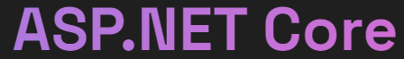

# TeamCraft  
 

Это репозиторий GooseTeam, проект по проектной деятельности ЮФУ.    

TeamCraft - это сайт, для нахождения единомышленников по интересам или целям для дальнейшего создания команды с определенной целью. Данный сайт должен упростить поиск участников и\или команду, по скольку нет централизованного ресурса для такой задачи и приходиться перебирать весь интернет для этого.

---

# Цель

Разработать онлайн платформу с основным функционалом в виде создания профилей команд и пользователей, для дальнейшего выбора нужных профилей в поиске по фильтрам.

---

# ⚙️Технологии

      
    
    
    
    
     

    

---

